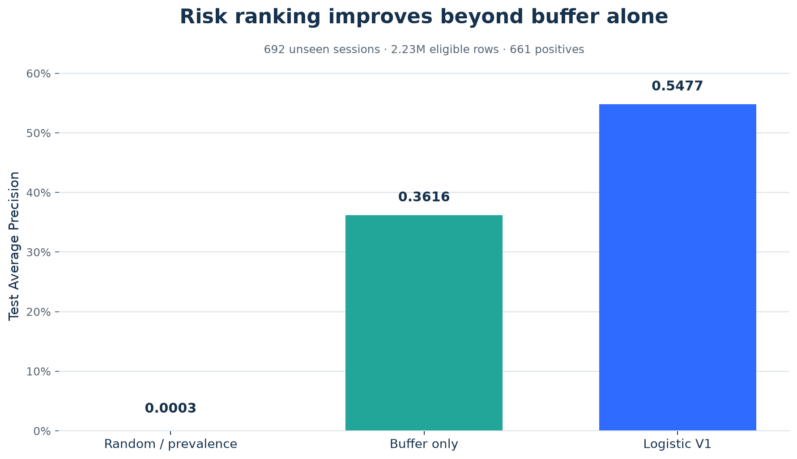
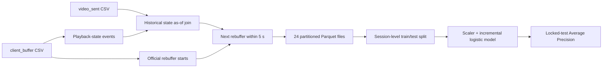
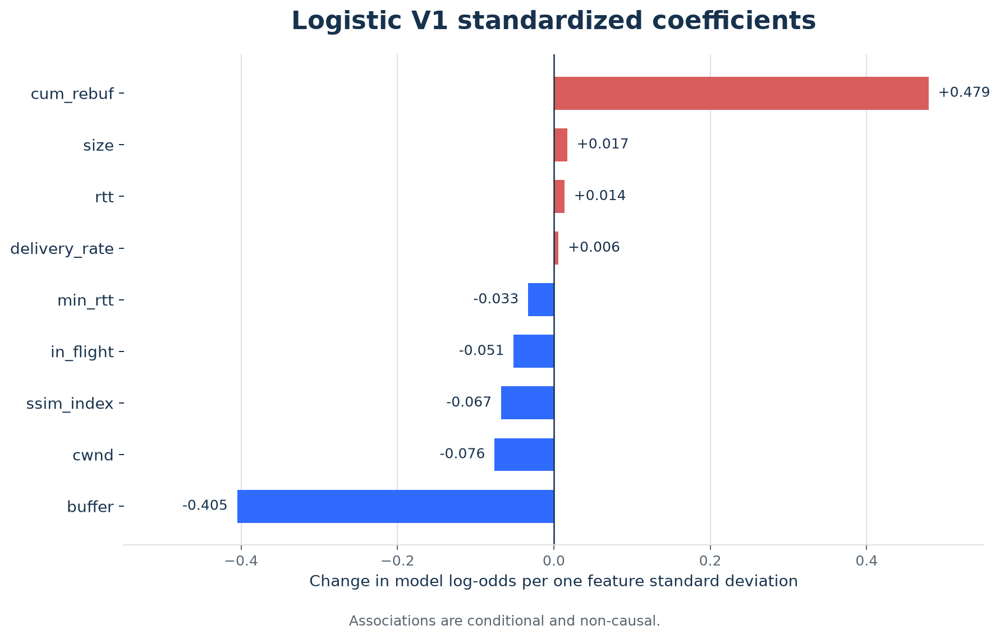

# Predicting Imminent Video Rebuffering from Streaming Telemetry

An interpretable rare-event modelling project built on public
[Stanford Puffer](https://puffer.stanford.edu/) telemetry.

At every video-chunk send, the model asks:

> **Will this stream begin rebuffering within the next five seconds?**

The final V1 pipeline processes 11.9 million chunk-send records, reconstructs
playback state without using future acknowledgements, separates train and test by
session, and evaluates a regularized logistic model on previously unseen sessions.



## Result at a glance

| Risk ranking | Test Average Precision |
|---|---:|
| Random / prevalence baseline | 0.0003 |
| Buffer only | 0.3616 |
| Logistic V1 | **0.5477** |

The logistic model improves Average Precision by **0.186 absolute** and **51%
relative** over ranking observations by buffer alone.

This is a ranking result—not a claim that 54.8% of freeze events were detected.
No probability threshold was tuned on the test set.

## Why this problem is harder than it first appears

The modelling code is short. Defining an honest row and label was the difficult
part.

Three traps mattered:

1. **The obvious freeze label was wrong.** A first attempt treated increases in
   `cum_rebuf` as freeze starts. A manually reconstructed timeline showed that the
   cumulative value often updates at the later `play`/resume event. V1 therefore
   uses Puffer's explicit `event == "rebuffer"` as the authoritative start.
2. **Most sent rows are not independent.** Adjacent observations share a session,
   TCP connection and playback history. Random row splitting would leak session
   behaviour into test, so the outer split is session-disjoint.
3. **The event is extremely rare.** Only 661 of 2,229,031 eligible test rows are
   positive. An all-negative classifier would appear to achieve 99.97% accuracy,
   so Average Precision is the primary metric.

## Prediction design

One observation is an eligible `video_sent` row while reconstructed playback state
is `playing`.

```text
target_5s = 1
if the next official rebuffer event in the same session_id + index
occurs strictly after sent_time and within five seconds
```

Rows in startup buffering, rows already rebuffering and rows with unknown playback
state are excluded.

The nine V1 features are:

```text
buffer, size, ssim_index, cwnd, in_flight,
min_rtt, rtt, delivery_rate, cum_rebuf
```

Future ACK time, `freeze_start_time` and `seconds_until_freeze` are never model
features.

## Data pipeline



Processed data summary:

| Stage | Rows |
|---|---:|
| Raw chunk sends | 11,900,686 |
| Eligible playing rows | 10,877,668 |
| Positive five-second labels | 2,851 |
| Unknown-state rows excluded | 955,982 |

The labelled dataset is stored locally as 24 Snappy-compressed Parquet parts
(approximately 0.36 GB). Raw and processed data are deliberately excluded from
Git.

## Leakage-safe validation

| Split | Sessions | Rows | Positive sessions | Positive rows |
|---|---:|---:|---:|---:|
| Development | 2,765 | 8,648,637 | 151 | 2,190 |
| Test | 692 | 2,229,031 | 38 | 661 |

Train/test session overlap is exactly zero.

Positive examples are also highly concentrated: the top ten development sessions
contain 58.05% of positive rows. Five development CV folds are saved for future
model comparison and threshold work, but V1 was fixed without CV tuning.

## Baseline and model

The fixed development rule `buffer < 1 second` is intentionally simple:

```text
Precision: 46.07%
Recall:    17.40%
Alert rate: 0.0096%
```

It produces reliable alerts but misses most positive rows.

Logistic V1 uses `StandardScaler` followed by an L2-regularized
`SGDClassifier(loss="log_loss")`. Incremental `partial_fit()` training makes the
8.65-million-row development set manageable without changing the model family:
this is still logistic regression.



The two largest standardized associations are:

- higher historical `cum_rebuf` → higher modelled near-term risk;
- higher current `buffer` → lower modelled near-term risk.

Coefficients are conditional associations, not causal effects. For example, the
near-zero positive delivery-rate coefficient should not be read as "faster delivery
causes freezes." Development-only stratification showed that higher delivery rate
usually corresponded to lower risk within sufficiently populated buffer bands,
suggesting correlated features and additive-model limitations.

## Repository map

```text
.
├── README.md
├── requirements.txt
├── notebooks/
│   ├── 00_fake_data_audit.ipynb
│   ├── 01_real_data_audit.ipynb
│   └── 02_target_definition.ipynb
├── src/
│   ├── download_puffer_sample.py
│   └── make_readme_figures.py
├── reports/
│   ├── figures/
│   └── tables/
└── docs/
    ├── Phase1_Research_Flow_EN.md
    ├── Phase2_Modelling_Report_EN.md
    ├── DATA_CARD.md
    ├── MODEL_CARD.md
    ├── DECISION_LOG.md
    └── UNKNOWN_UNKNOWNS.md
```

Start with:

- [Phase 1: target and state reconstruction](docs/Phase1_Research_Flow_EN.md)
- [Phase 2: modelling and locked-test evaluation](docs/Phase2_Modelling_Report_EN.md)
- [Model card](docs/MODEL_CARD.md)
- [Data card](docs/DATA_CARD.md)
- [Decision log](docs/DECISION_LOG.md)

## Reproducing the environment

```bash
python3 -m venv .venv
source .venv/bin/activate
python -m pip install --upgrade pip
python -m pip install -r requirements.txt
```

Download Puffer's official small fake sample:

```bash
python src/download_puffer_sample.py
```

Then open:

```bash
jupyter lab
```

The fake sample is suitable for schema and pipeline inspection. Reproducing the
full reported experiment requires the public Puffer daily files for
`2026-07-19T11_2026-07-20T11`, placed under:

```text
data/raw/real/2026-07-19/
```

The repository does not redistribute the multi-gigabyte raw telemetry or trained
artifact. Notebook outputs and aggregate result tables are retained so the reported
analysis remains inspectable.

Regenerate README figures with:

```bash
python src/make_readme_figures.py
```

## What V1 establishes

- An explicit event label is safer than inferring freeze start from a cumulative
  counter.
- Session-level isolation still produces strong ranking performance.
- Buffer alone is a powerful baseline, but other sent-time telemetry adds material
  ranking value.
- A scalable and interpretable linear model is sufficient for a credible first
  result.

## What V1 does not establish

- Event-level freeze recall;
- calibrated probabilities;
- an operational alarm threshold;
- cross-date or cross-platform generalisation;
- causal effects of network variables;
- a production TikTok bitrate policy.

## Roadmap beyond the portfolio V1

The current repository is a complete baseline study. Future research phases are:

1. external validation on a new Puffer date;
2. event-level detection metrics;
3. out-of-fold calibration and threshold selection;
4. mechanism features such as `size / delivery_rate` and buffer margin;
5. GAM/spline and tree-based comparisons;
6. a cost-aware simulated playback action.

## Data and attribution

This project uses public research telemetry from Stanford Puffer. It does not use
TikTok internal data and does not claim production deployment.

- [Puffer data description](https://puffer.stanford.edu/data-description/)
- [Puffer repository](https://github.com/StanfordSNR/puffer)
- [Puffer paper](https://puffer.stanford.edu/static/puffer/documents/puffer-paper.pdf)

